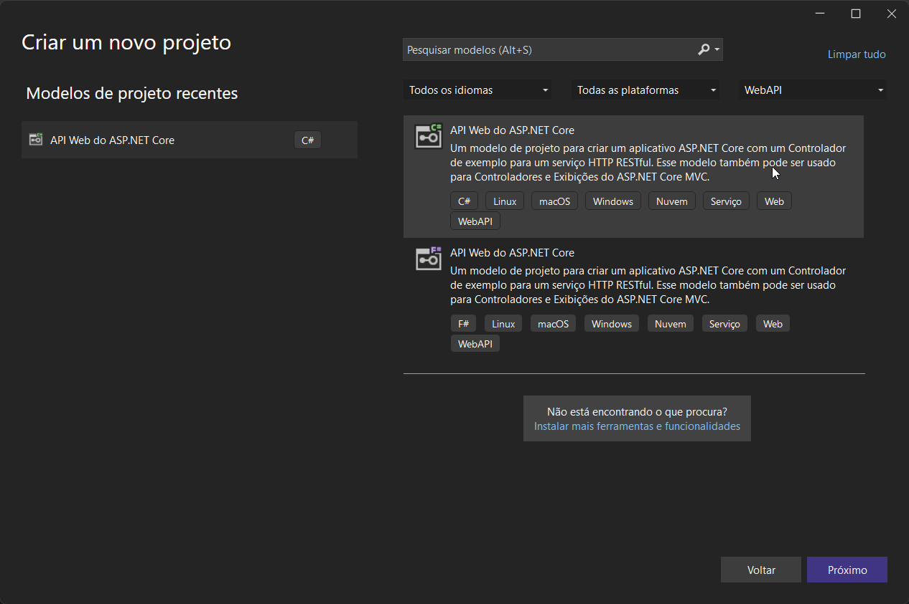
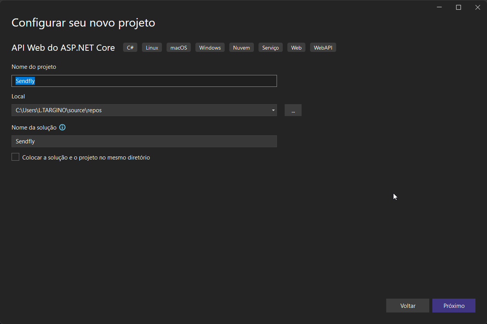
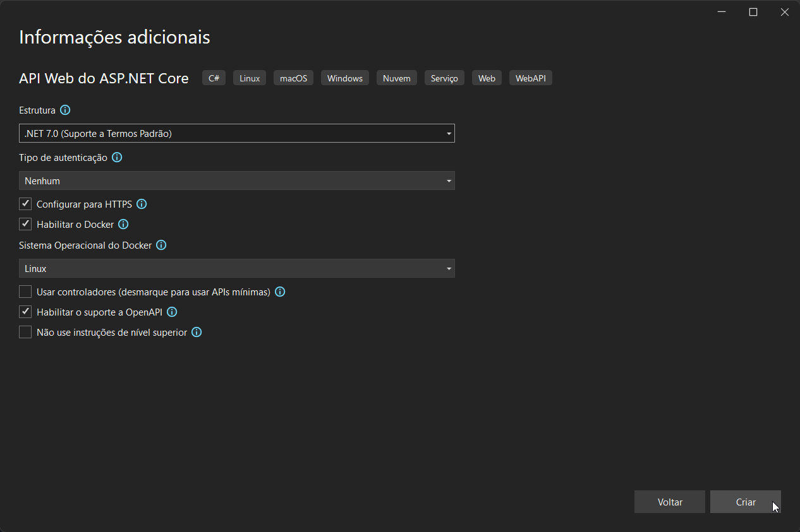
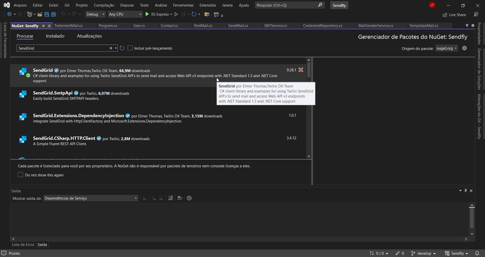
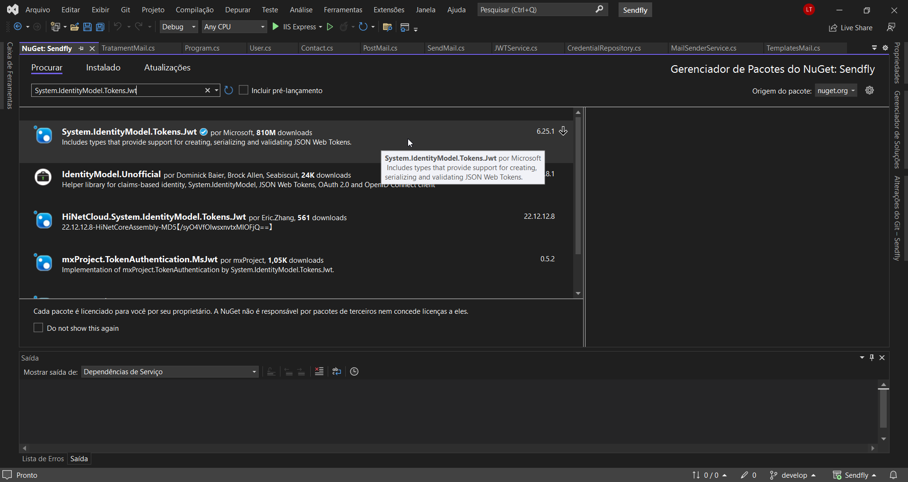
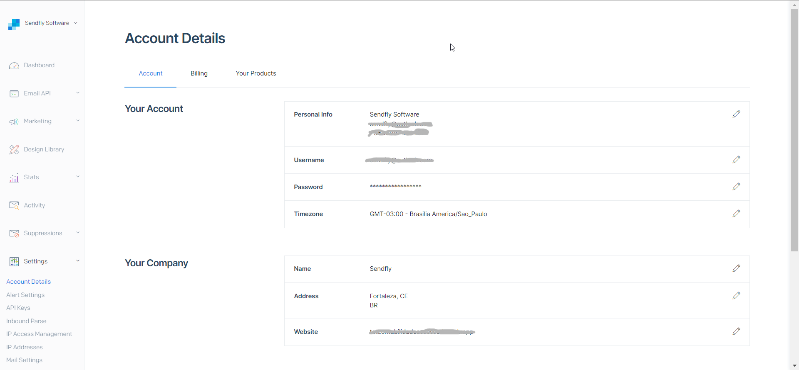
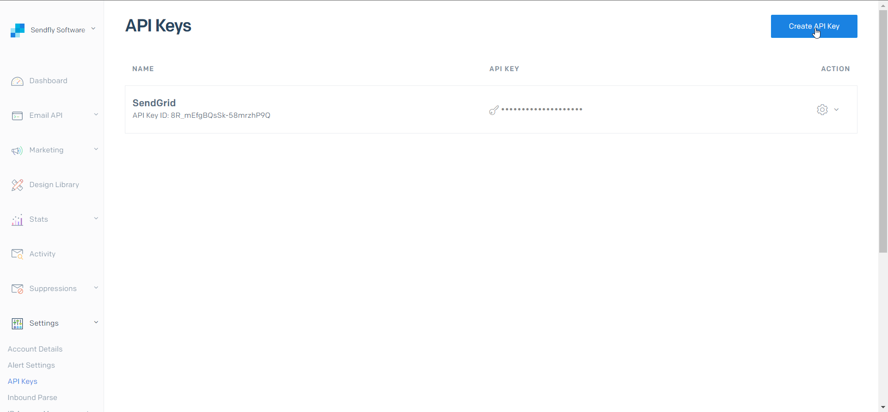
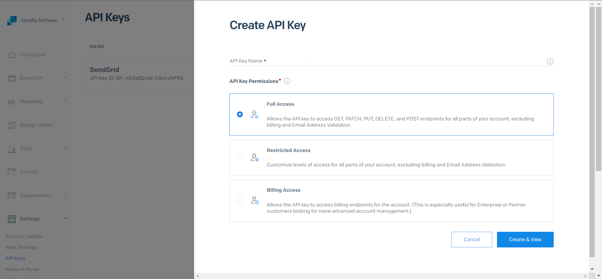
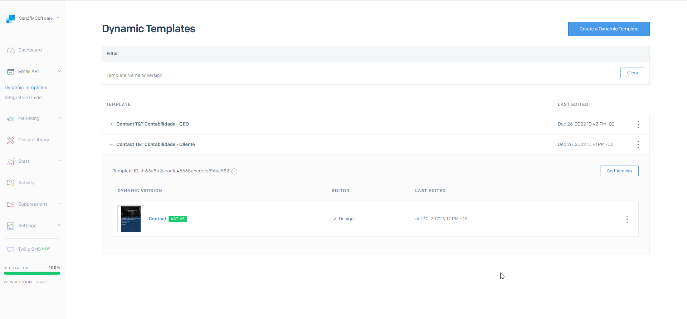
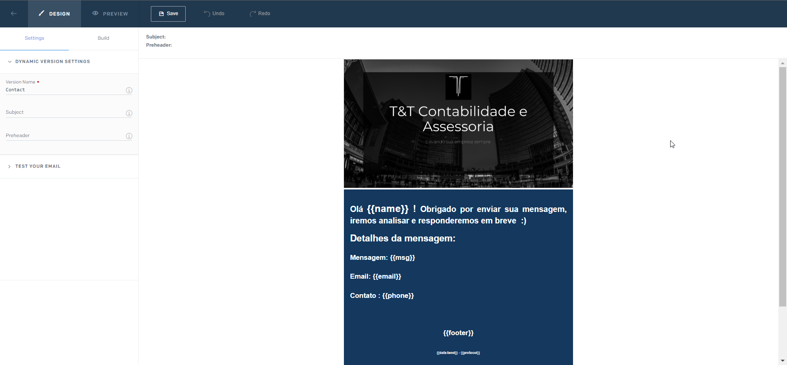

# 📨 Sendfly


<figure><figcaption></figcaption></figure>

## Inicializando a solução no VisualStudio configure do seguinte modo:

* Selecionar opção de projeto "_API Web do ASP.NET Core"_
* Informe o nome do projeto
* Utilize a estrutura .NET 7.0, caso não tenha o SDK 7.0.1 instalado em sua maquina segue o link [https://dotnet.microsoft.com/en-us/download/dotnet/7.0](https://dotnet.microsoft.com/en-us/download/dotnet/7.0)
* Selecione _"Configurar para HTTPS"_
* Habilitar Docker (Opcional)
* Habilite o _suporte a OpenAPI_ para utilizarmos Swagger como Documentação Microserviço API

<div>

<figure><figcaption></figcaption></figure>

 

<figure><figcaption></figcaption></figure>

 

<figure><figcaption></figcaption></figure>

</div>

Proximo passo vamos precisar criar a pasta Models com subpasta Auth e Mail adicionando os seguintes arquivos .cs:

### Models/Auth

* User

```csharp
using System.ComponentModel.DataAnnotations;
namespace Sendfly.Models.Auth
{
    public class User
    {
        [Required(ErrorMessage = "Enter Username !")]
        public string Username { get; set; }
        [Required(ErrorMessage = "Enter Password !")]
        public string Password { get; set; }
        [Required(ErrorMessage = "Enter Role !")]
        public string Role { get; set; }
    }
}

```

#### # A classe User.cs ficará destinada ao controle de Autenticação de usuário onde veremos mais a frente com o uso do Serviço JWT Token.

### Models/Mail

* Contact.cs
* PostMail.cs
* SendMail.cs

```csharp
namespace Sendfly.Models.Mail
{
    public class Contact
    {
        public string Id { get => Guid.NewGuid().ToString(); }
        public string NamePerson { get; set; }
        public string Email { get; set; }
        public string Phone { get; set; }
        public string Msg { get; set; }
    }
}

```

#### # A Classe Contact.cs ficará responsável para atribuir ao Client a identificação do cliente e suas informações de contato sobre o requisitor.

```csharp
using System.Text.Json.Serialization;
namespace Sendfly.Models.Mail
{
    public class PostMail
    {
        public string Subject { get; set; }
        public Contact Contact { get; set; }
    }
}

```

#### #A Classe PostMail toma como corpo do envio herdando atributos da classe Contact e o titulo da mensagem no Subject.

```csharp
namespace Sendfly.Models.Mail
{
    public class SendMail
    {
        public string ApiKey { get; set; }
        public string SenderMail { get; set; }
        public string SenderName { get; set; }
    }
}

```

#### # A Classe SendMail.cs será utilizada como atributos de integração do serviço de e-mail SendGrid.

## Instalar os seguintes pacotes no _Gerenciar pacotes do nuget:_&#x20;

* SendGrid
* System.IdentityModel.Tokens.Jwt

<div>

<figure><figcaption></figcaption></figure>

 

<figure><figcaption></figcaption></figure>

</div>


## Cadastrar e configurar chave de acesso API SendGrid

* Acesse o seguinte URL [https://sendgrid.com/](https://sendgrid.com/) para realizar o cadastro de usuário

<figure><figcaption></figcaption></figure>

#### # Cretifique-se de chegar nessa tela _Settings/Account Details_ com os campos preenchidos de seu _Your Account e Your Company_

<figure><figcaption></figcaption></figure>

#### #  Na opção _API Keys_ Cadastre uma nova chave de API  para inserir mais a frente nas credenciais de acesso do nosso projeto.

<figure><figcaption></figcaption></figure>

#### # Ad

#### # Selecione a opção Full Access e identifique sua API Key name, em seguida será apresentado um hash de caracteres onde você deve guardar pois ele não será apresentado novamente.

<figure><figcaption></figcaption></figure>

#### # Prosseguimos com a criação de dois  Templates de e-mail  sendo um para o Cliente recebendo e-mail automatico e outra com uma copia do envio para o  CEO responsável pelo site, nessa etapa como regra de criação você irá possuir ID's de cada template onde será utilizado em seguida no código do projeto.&#x20;

<figure><figcaption></figcaption></figure>

#### # Segue como exemplo no template as _variaveis json_ \{{ name \}}, \{{ msg \}}, \{{ email \}}, \{{ phone \}}, \{{ footer \}}, \{{ data send \}}, \{{ protocol \}} que será utilizada no corpo da requisição de envio.

## Codificar Serviços, Autenticação e Endpoints da API

* Modifique o arquivo _appsettings.json ou appsettings.Development.json com os seguinte valores:_

```csharp
{
  "Logging": {
    "LogLevel": {
      "Default": "Information",
      "Microsoft.AspNetCore": "Warning"
    }
  },
  "AllowedHosts": "*",

  "SendGrid": {
    "Key": "***** KEY SEND GRID *****",
    "Mail": "***** YOUR EMAIL CONFIGURED IN SEND GRID *****",
    "NameContact": "***** PRESENTATION OF NAME IN THE TITLE OF THE EMAIL *****"
  },

  "SettingMailCeo": {
    "Mail": "***** REPLY E-MAIL CEO *****"
  }
}

```

#### # Nos parâmetros de valores "SendGrid" informe a chave criada no SendGrid "Key": "\<API KEY>", E-mail configurado no SendGrid  em Your Account "Mail":"\<YOU EMAIL CONFIGURED>" e seu nome de contato também configurado "NameContact":"\<NAME TITLE EMAIL>", No parâmetro de valores "SettingMailCeo" informe um e-mail terceiro utilizado pelo CEO em "Mail":"\<REPLY E-MAIL>"&#x20;

#### Próximo passo vamos criar a pasta Services com subpastas ServiceAuth, ServiceMail e Trataments contendo as classes de serviço e interfaces de acesso aos métodos publicos.

## Services/ServiceAuth

* CredentialRepository.cs

<pre class="language-csharp"><code class="lang-csharp">using Sendfly.Models.Auth;
using Sendfly.Services.ServiceAuth.Interfaces;

namespace Sendfly.Services.ServiceAuth
{
<strong> public class CredentialRepository : ICredentialRepository
</strong>    {
        private readonly IJWTService _jWTService;

        public CredentialRepository(IJWTService jWTService)
        {
            _jWTService = jWTService;
        }

        public object PrepareCredentials(User user)
        {
            try
            {
                var result = Get(user);
                if (result is null)
                    return null;

                //Generate jwt token according to credentials
                var token = _jWTService.GenerateToken(user);
                var dataHoraValidado = DateTime.Now;
                var dataExpira = TimeSpan.FromHours(24);
                DateTime dt = dataHoraValidado + dataExpira;

                return new
                {
                    token,
                    dataHoraValidado = dataHoraValidado.ToString(),
                    dataHoraExpira = dt.ToString()
                };
            }
            catch (Exception)
            {
                throw;
            }
        }

        private static User Get(User user)
        {
            return _ = (user.Username == "&#x3C;your username>" &#x26;&#x26; user.Password == "your password" &#x26;&#x26; user.Role == "your permission") ? user : null;
        }
    }
}
</code></pre>

* JWTService.cs

```csharp
using Microsoft.IdentityModel.Tokens;
using Sendfly.Models.Auth;
using Sendfly.Services.ServiceAuth.Interfaces;
using Sendfly.Utils;
using System.IdentityModel.Tokens.Jwt;
using System.Security.Claims;
using System.Text;

namespace Sendfly.Services.ServiceAuth
{
    public class JWTService : IJWTService
    {
        public string GenerateToken(User user)
        {
            var tokenHandler = new JwtSecurityTokenHandler();
            //Add Secret Key in SettingsJWT.cs file in Utils folder
            var key = Encoding.ASCII.GetBytes(SettingsJWT.SecretKey);
            var tokenDescriptor = new SecurityTokenDescriptor
            {
                Subject = new ClaimsIdentity(new Claim[]
                {
                    new Claim(ClaimTypes.Name, user.Username.ToString()),
                    new Claim(ClaimTypes.Role, user.Role.ToString())
                }),
                Expires = DateTime.UtcNow.AddDays(1),
                SigningCredentials = new SigningCredentials(new SymmetricSecurityKey(key), SecurityAlgorithms.HmacSha256Signature)
            };
            var token = tokenHandler.CreateToken(tokenDescriptor);
            return tokenHandler.WriteToken(token);
        }
    }
}

```

## Services/ServiceAuth/Interfaces

* ICredentialRepository.cs

```csharp
using Sendfly.Models.Auth;

namespace Sendfly.Services.ServiceAuth.Interfaces
{
    public interface ICredentialRepository
    {
        object PrepareCredentials(User user);
    }
}

```

* IJWTService.cs

```csharp
using Sendfly.Models.Auth;

namespace Sendfly.Services.ServiceAuth.Interfaces
{
    public interface IJWTService
    {
        string GenerateToken(User user);
    }
}
```

## Service/ServiceMail

* MailSenderService.cs

```csharp
using Microsoft.Extensions.Options;
using Sendfly.Models.Mail;
using Sendfly.Services.MailServices.Interfaces;
using SendGrid;
using SendGrid.Helpers.Mail;
using static Sendfly.Utils.Templates.TemplatesMail;

namespace Sendfly.Services.MailServices
{
    public class MailSenderService : IMailSenderService
    {
        public SendMail Settings { get; set; }
        private readonly IConfiguration _configuration;

        public MailSenderService(IOptions<SendMail> settings, IConfiguration configuration)
        {
            Settings = settings.Value;
            _configuration = configuration;
        }

        public async Task<IEnumerable<Response>> SendMailAsync(dynamic dataMail)
        {
            string messageFooter = new TemplateContact().ContactSenderMail();
            return await ExecuteMail(Settings.ApiKey, messageFooter, dataMail);
        }

        private async Task<IEnumerable<Response>> ExecuteMail(string apiKey, string messageFooter, dynamic dataMail)
        {
            try
            {
                //Validate credentials
                var client = new SendGridClient(apiKey);

                var msg = new SendGridMessage
                {
                    From = new EmailAddress(Settings.SenderMail, Settings.SenderName),
                    Subject = dataMail.Subject
                };

                //email array
                string[] mailsArray = dataMail.Emails.Split(',');

                List<EmailAddress> mails = new();
                List<Response> responses = new();

                foreach (var value in mailsArray)
                {
                    mails.Add(new EmailAddress(value));

                    //Conditions Customer and CEO template
                    msg.TemplateId = value == _configuration.GetSection("SettingMailCeo:Mail").Value ? "<CEO TEMPLATE>" : "<CLIENT TEMPLATE>";

                    msg.AddTo(new EmailAddress(value));

                    //SendGrid Template Body Values
                    dynamic dataMailTemplate = new
                    {
                        msg = dataMail.Msg,
                        name = dataMail.Name,
                        email = dataMail.Email,
                        phone = dataMail.Phone,
                        footer = messageFooter,
                        protocol = dataMail.Id,
                        dataSend = dataMail.DtSend,
                    };

                    msg.AddTo(new EmailAddress(value));
                    msg.SetTemplateData(dataMailTemplate);

                    //Disabled settings for SEND GRID
                    msg.SetClickTracking(false, false);
                    msg.SetOpenTracking(false);
                    msg.SetGoogleAnalytics(false);
                    msg.SetSubscriptionTracking(false);
                    //Returns send grid server information
                    responses.Add(await client.SendEmailAsync(msg));
                }

                return responses.ToList();
            }
            catch (Exception)
            {
                throw;
            }
        }
    }
}

```

## Service/ServiceMail/Interfaces

* IMailSenderService.cs

```csharp
using SendGrid;

namespace Sendfly.Services.MailServices.Interfaces
{
    public interface IMailSenderService
    {
        Task<IEnumerable<Response>> SendMailAsync(dynamic dataMail);
    }
}

```

## Services/Trataments

* TratamentMail.cs

```csharp
using Sendfly.Models.Mail;
using Sendfly.Services.Trataments.Interfaces;
using System.Dynamic;
using System.Globalization;

namespace Sendfly.Services.Trataments
{
    public class TratamentMail : ITratamentMail
    {
        private readonly IConfiguration _configuration;

        public TratamentMail(IConfiguration configuration)
        {
            _configuration = configuration;
        }

        //Prepare email sending data
        public dynamic ConfigDataMail(PostMail postMail)
        {
            dynamic dataMail = new ExpandoObject();
            dataMail.Subject = postMail.Subject;
            dataMail.Emails = string.Join(",", postMail.Contact.Email, _configuration.GetSection("SettingMailCeo:Mail").Value);
            dataMail.Id = postMail.Contact.Id;
            dataMail.Name = postMail.Contact.NamePerson;
            dataMail.Email = postMail.Contact.Email;
            dataMail.Phone = postMail.Contact.Phone;
            dataMail.Msg = postMail.Contact.Msg;
            dataMail.DtSend = DateTime.Now.ToString("g", CultureInfo.CreateSpecificCulture("pt-BR"));

            return dataMail;
        }
    }
}
```

## Services/Trataments/Interfaces

* ITratamentMail.cs

```csharp
using Sendfly.Models.Mail;

namespace Sendfly.Services.Trataments.Interfaces
{
    public interface ITratamentMail
    {
        dynamic ConfigDataMail(PostMail postMail);
    }
}

```

#### Vamos criar também a pasta Utils com subpastas Templates adicionando métodos com valores estáticos apresentando texto no rodapé do e-mail

## Utils/Templates

* TemplatesMail.cs

```csharp
namespace Sendfly.Utils.Templates
{
    public class TemplatesMail
    {
        public struct TemplateContact
        {
            public string ContactSenderMail() => "We received your message by email and will respond shortly with more details, thank you for contacting us. !";
        }
    }
}

```

#### Concluindo nesta última etapa vamos implementar os grupos endpoints de modo Minimal API's, Adicionar injeções de dependencia dos services, Adicionar serviço de opções para uso das credenciais SendGrid e aplicar configurações do JWT com a documentação Swagger no Program.cs

## Program.cs

```csharp
using Microsoft.AspNetCore.Authentication.JwtBearer;
using Microsoft.AspNetCore.Authorization;
using Microsoft.AspNetCore.Mvc;
using Microsoft.IdentityModel.Tokens;
using Microsoft.OpenApi.Models;
using Sendfly.Models.Auth;
using Sendfly.Models.Mail;
using Sendfly.Services.MailServices;
using Sendfly.Services.MailServices.Interfaces;
using Sendfly.Services.ServiceAuth;
using Sendfly.Services.ServiceAuth.Interfaces;
using Sendfly.Services.Trataments;
using Sendfly.Services.Trataments.Interfaces;
using Sendfly.Utils;
using System.Text;

var builder = WebApplication.CreateBuilder(args);

// Add services to the container.

builder.Services.AddControllers();
// Learn more about configuring Swagger/OpenAPI at https://aka.ms/aspnetcore/swashbuckle
builder.Services.AddEndpointsApiExplorer();
builder.Services.AddSwaggerGen(s =>
{
    s.SwaggerDoc("v1", new OpenApiInfo
    {
        Title = "SENDFLY",
        Version = "v1",
        Description = "Microservice send E-mail",
    });
    s.AddSecurityDefinition("Bearer", new OpenApiSecurityScheme
    {
        Name = "Authorization",
        Type = SecuritySchemeType.ApiKey,
        Scheme = "Bearer",
        BearerFormat = "JWT",
        In = ParameterLocation.Header,
        Description = "JWT Authorization header using the Bearer scheme."
    });
    s.AddSecurityRequirement(new OpenApiSecurityRequirement
        {
                    {
                          new OpenApiSecurityScheme
                            {
                                Reference = new OpenApiReference
                                {
                                    Type = ReferenceType.SecurityScheme,
                                    Id = "Bearer"
                                }
                            },
                            Array.Empty<string>()
                    }
        });
});
builder.Services.AddCors();

// *************** SERVICES DI - DEPENDENCES INJECTION ***************
builder.Services.AddTransient<ICredentialRepository, CredentialRepository>();
builder.Services.AddTransient<IJWTService, JWTService>();
builder.Services.AddTransient<IMailSenderService, MailSenderService>();
builder.Services.AddTransient<ITratamentMail, TratamentMail>();
builder.Services.AddSingleton<IConfiguration>(builder.Configuration);

//********************* SETTINGS JWT  **********************
//Add Secret Key in SettingsJWT.cs file in Utils folder
var key = Encoding.ASCII.GetBytes(SettingsJWT.SecretKey);
builder.Services.AddAuthentication(x =>
{
    x.DefaultAuthenticateScheme = JwtBearerDefaults.AuthenticationScheme;
    x.DefaultChallengeScheme = JwtBearerDefaults.AuthenticationScheme;
})
.AddJwtBearer(x =>
{
    x.RequireHttpsMetadata = false;
    x.SaveToken = true;
    x.TokenValidationParameters = new TokenValidationParameters
    {
        ValidateIssuerSigningKey = true,
        IssuerSigningKey = new SymmetricSecurityKey(key),
        ValidateIssuer = false,
        ValidateAudience = false,
        ValidateLifetime = true,
        RequireExpirationTime = true,
    };
});

//********************* SETTINGS SEND GRID  **********************
builder.Services.Configure<SendMail>(opt =>
{
    opt.ApiKey = builder.Configuration.GetSection("SendGrid:Key").Value;
    opt.SenderMail = builder.Configuration.GetSection("SendGrid:Mail").Value;
    opt.SenderName = builder.Configuration.GetSection("SendGrid:NameContact").Value;
});

var app = builder.Build();

// Configure the HTTP request pipeline.
if (app.Environment.IsDevelopment())
{
    app.UseSwagger();
    app.UseSwaggerUI();
}

app.UseCors(opt => opt
    .AllowAnyHeader()
    .AllowAnyMethod()
    .AllowAnyOrigin());

app.UseHttpsRedirection();

app.UseRouting();

var authEndpoint = app.MapGroup("/api/v1/auth/");

var sendMail = app.MapGroup("/api/v1/sendMail/");

authEndpoint.MapPost("login", [AllowAnonymous] ([FromBody] User user, ICredentialRepository credentialRepository) =>
{
    try
    {
        var result = credentialRepository.PrepareCredentials(user);
        if (result is null)
            return Results.Unauthorized();

        return Results.Ok(result);
    }
    catch (Exception) { throw; }
})
.WithName("Auth")
.WithOpenApi();

sendMail.MapPost("PostSendMail", [Authorize] async ([FromBody] PostMail postMail, IMailSenderService mailSenderService, ITratamentMail tratamentMail) =>
{
    try
    {
        return Results.Ok(await mailSenderService.SendMailAsync(tratamentMail.ConfigDataMail(postMail)));
    }
    catch (Exception) { throw; }
})
.WithName("SendMail")
.WithOpenApi();

app.UseAuthentication();
app.UseAuthorization();

app.MapControllers();

app.Run();

```

Conclusão: Neste projeto podemos aprimorar praticas de uso de serviço de email SendGrid para ser aplicados em sistemas web integrado com microserviço de e-mail, utilizando tecnologias .NET em sua nova versão 7.0 com Minimal API's, aplicando tambem o uso de segurança para autenticação de usuário com JWT Token. Diante desta colaboração espero que todos possam aproveitar o maximo do conteúdo apresentado, até breve !
